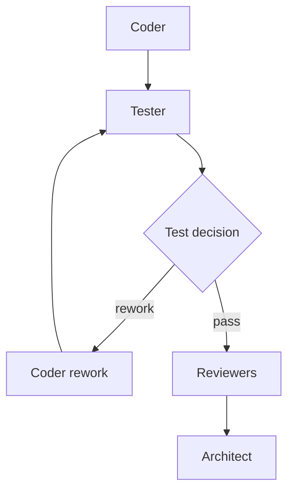
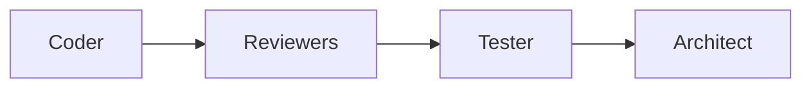

# Pipeline overlays — design draft

## Status

This document records an early design direction. Pipeline overlays are not an
implemented schema or runtime contract. The examples below are illustrative;
field names and exact operations remain subject to validation against the
default pipeline migration.

## Motivation

A user should not have to copy and maintain the complete default pipeline in
order to make a small process change. A common case is adding one role, its
prompt and schemas, and inserting its state into an existing part of the
workflow.

The default pipeline remains an ordinary portable bundle. An overlay is a
second declarative bundle that composes with an explicitly identified base
before a run starts.

## Composition model

An overlay is compile-time input, not a mutation of a running pipeline:

```text
base bundle + ordered overlays -> effective pipeline -> full validation -> immutable snapshot
```

The orchestrator must never execute a partially composed graph. Every overlay
operation is applied to a private candidate representation. The candidate
becomes executable only after the complete graph, data flow, referenced files,
decision models and profile references pass the normal pipeline validation.

No overlay may be applied after the immutable execution snapshot has been
created. Resume, when implemented, must use the exact effective-pipeline
identity recorded for the original run.

## Base identity and reproducibility

An overlay identifies its base exactly, initially by the shipped pipeline id
and a cryptographic digest. A digest mismatch fails closed and requires an
explicit rebase; the orchestrator must not apply an overlay approximately to a
different revision of the default pipeline.

For multiple overlays, order is explicit and participates in the effective
pipeline digest. Every successful composition records:

- the base pipeline identity and digest;
- the ordered overlay identities and digests;
- the digest of the materialized effective pipeline.

The effective pipeline should be exportable for inspection and debugging. Its
behavior must not depend on ambient files, directory enumeration order, wall
clock time, or mutable global state.

## Overlay bundle

An overlay may carry its own declarative resources, for example:

```text
overlay.yaml
prompts/
schemas/
decisions/
```

Every referenced resource is resolved relative to its owning overlay and
obeys the same realpath-containment and regular-file rules as a normal
pipeline bundle. Composition must retain unambiguous file provenance; two
bundles must not silently shadow each other's files.

An overlay may reference operator-provided profiles by name. It cannot embed
credentials, helper endpoints, mounts, host paths, arbitrary commands, or
other runtime authority. Adding an overlay therefore cannot widen the
capability ceiling established by the selected Launcher and trusted profiles.

## Initial semantic operations

The initial scope should be deliberately narrow:

- add a new state with a unique id;
- insert that state on one named transition;
- add a declared input port to an existing state.

Transition insertion is guarded by an exact precondition. Conceptually:

```yaml
- insert_state_on_transition:
    from: coder
    outcome: completed
    expect_to: architect
    state: tester
```

This replaces:

```text
coder --completed--> architect
```

with:

```text
coder --completed--> tester --completed--> architect
```

If the current base no longer contains exactly the expected transition, the
operation fails. It must not search for a similar place or silently adapt.

Adding an input port is also explicit:

```yaml
- add_state_input:
    state: architect
    input:
      id: test_report
      source:
        state_output:
          state: tester
          output: test_report
```

There is no automatic forwarding of a newly added state's outputs to the next
state. Pipeline-relevant data flow remains visible in the effective pipeline.

Arbitrary JSON Patch, YAML paths, array-index edits and unrestricted field
replacement are intentionally excluded from the initial design. They are
fragile across base revisions and make semantic validation and useful
conflict diagnostics substantially harder.

## Testing extension example

The first reference extension should provide one reusable tester role bundle
and two alternative placement overlays. This demonstrates that role assets and
process placement are independent: the same prompt, schema, profile reference
and output contract can participate in different graphs without being copied
or changed.

The shared tester extension conceptually provides:

- a tester prompt;
- a JSON schema for a structured test report;
- a tester agent state referencing an operator-approved tester profile;
- a declared `test_report` output;
- explicit data-port bindings for every state that consumes the report;
- optionally, publication of the report as a run-level output.

The tester does not choose the next state. It produces only declared outputs.
A deterministic decision state or the existing architect decision layer maps
the accepted report to process outcomes.

### Variant A: test before reviewers

The early-feedback variant attaches the testing subgraph to the transition
from the coder to the reviewers:



A failed test outcome returns work to a coder activation; a passing outcome
continues to the reviewers. The test report must be connected explicitly to
the rework state and, if required, to the reviewers or architect.

A required `test_report` input cannot simply be added to the original coder
state because it is unavailable on the first coder activation. The first
example should therefore use a distinct coder-rework state that reuses the
coder role/profile while accepting the report. Optional/history-aware inputs
must not be invented implicitly merely to make the example work.

### Variant B: test after reviewers

The end-of-iteration variant attaches the same tester role after the reviewers
and before the architect's iteration decision:



Here the architect receives the structured test report together with the
review results and applies the existing deterministic decision model. Any
rework transition remains owned by that decision layer.

The two overlays should differ only in graph attachment and the explicit
data-port bindings required by that placement. The tester prompt, output
schema and profile reference stay identical. This pair is an acceptance test
for semantic composition: if moving the same role requires copying the
default pipeline or editing its internals by array index, the overlay model is
too brittle.

These variants still treat testing as a subgraph inside an existing stage
cycle. A full plan-driven “testing stage” is a separate question: stages and
their number belong to the plan and may be revisited. An overlay must not
hard-code a stage number. Before the example is promoted from state/subgraph
placement to a stage extension, the default pipeline's stage representation
and the operation that extends it must be formalized.

## Validation and conflicts

Composition fails closed on at least:

- base identity or digest mismatch;
- duplicate state, port, role, or resource identity;
- a failed operation precondition;
- more than one overlay attempting to own the same transition or field;
- missing or type-incompatible data sources;
- unreachable non-terminal states or unknown transition targets;
- invalid decision outcome coverage;
- bundle-file containment failure;
- an unknown or disallowed profile reference;
- any final pipeline invariant rejected by the ordinary compiler.

A failure leaves no partially composed pipeline and starts no Session.

## Open questions

The following points remain intentionally unresolved:

- the final overlay schema and versioning policy;
- whether the first implementation supports only the shipped default base or
  any external base bundle;
- how separate reusable role declarations map onto the current state-level
  profile and prompt fields;
- the formal representation of plan-driven stages and stage templates;
- conflict rules for multiple overlays beyond exact single-owner rejection;
- whether an explicit rebase assistant is part of the future pipeline wizard.

These questions do not block the current pipeline-v2 execution work. Overlay
support should begin only after the default pipeline has a stable materialized
v2 representation against which semantic operations can be specified and
tested.
